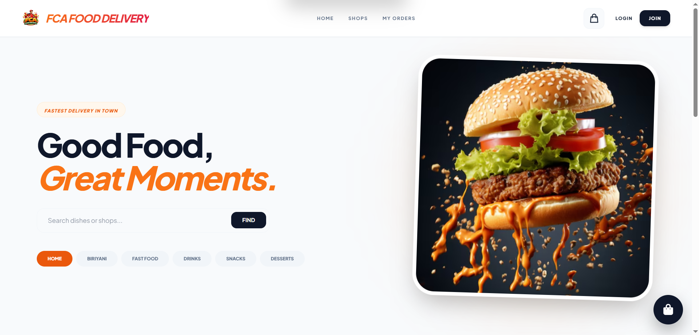
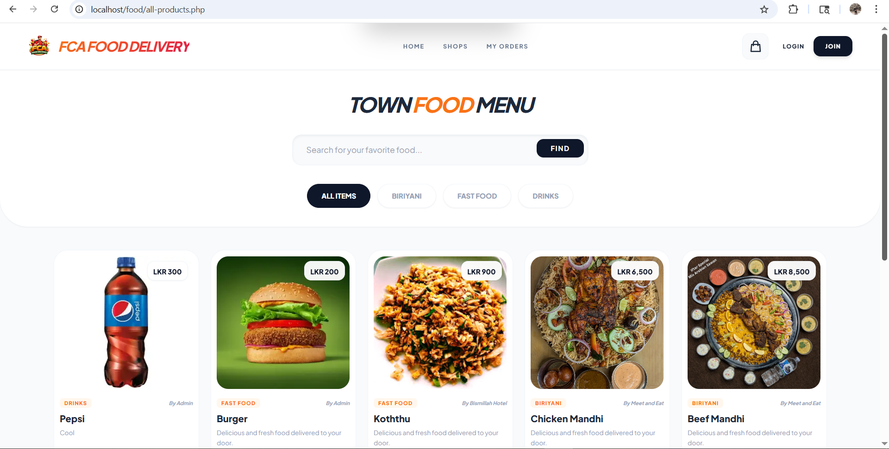
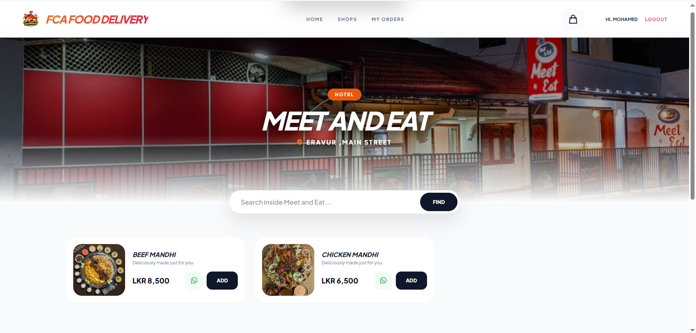
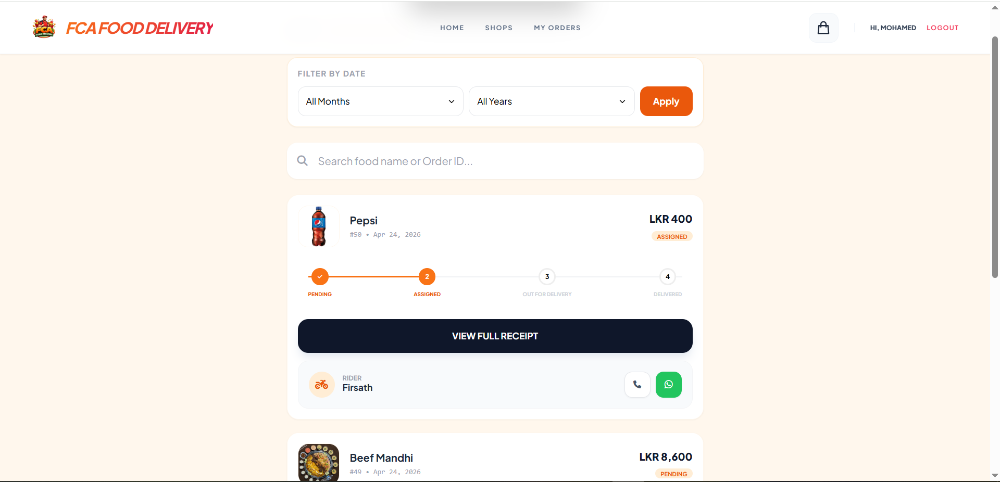
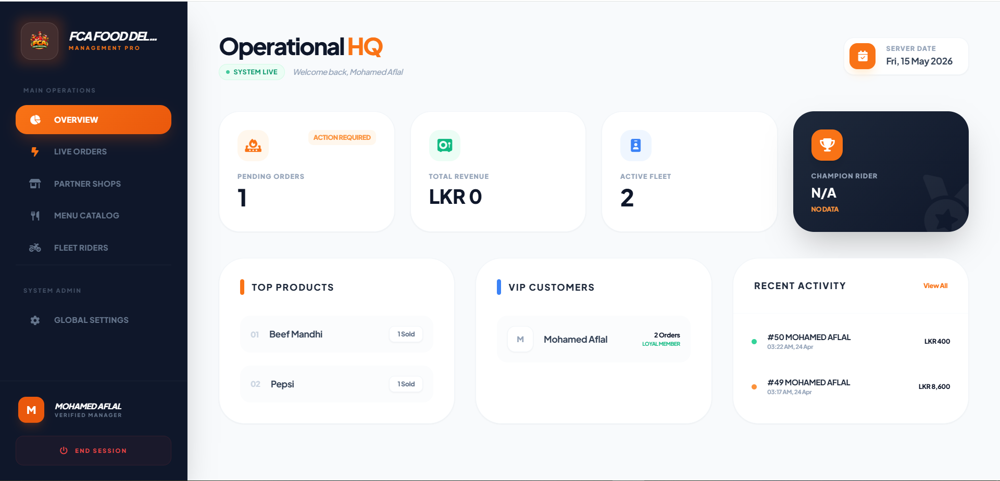
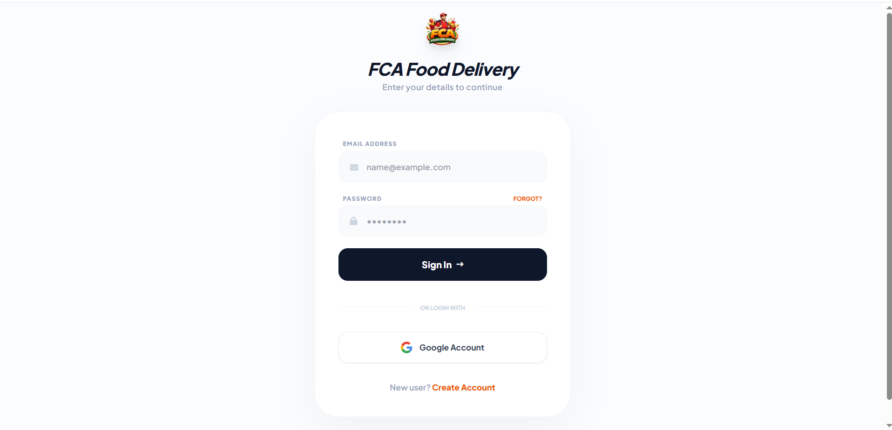
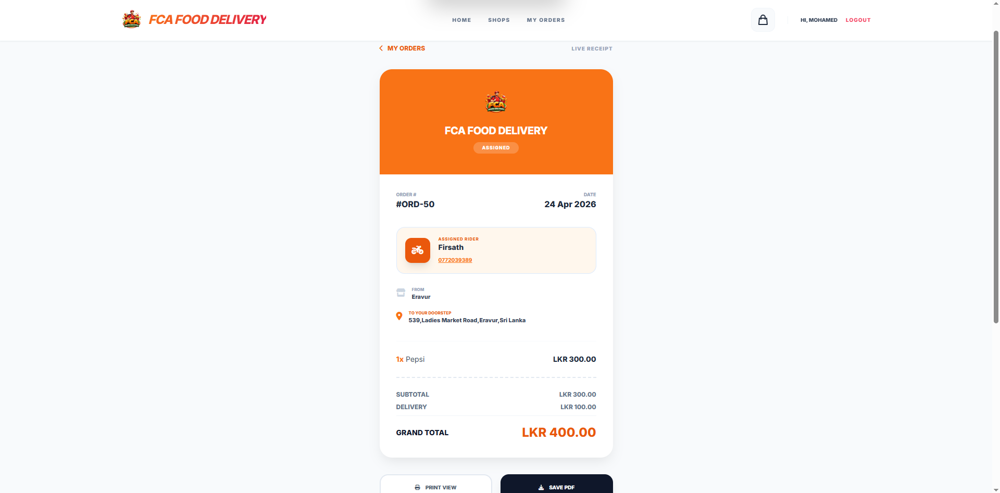

# 🍔 FCA Food Delivery System
**A Modern Multi-Vendor Food Ordering Solution with WhatsApp Integration.**

[](https://opensource.org/licenses/MIT)
[]()

---

## 🚀 Project Overview
FCA Food Delivery is a high-performance, mobile-responsive web application built with **PHP and MySQL**. It empowers local vendors to bring their businesses online. The system features a unique **WhatsApp Ordering Logic**, sending itemized bills directly to the vendor for instant processing.

### ✨ Key Features
- **Modern UI:** Clean, mobile-first design with Tailwind CSS and smooth AOS animations.
- **WhatsApp Checkout:** Direct order formatting sent to Admin/Vendor WhatsApp.
- **Admin Dispatch:** Dedicated panel to assign riders and manage order statuses.
- **Digital Invoices:** Professional PDF generation and print-ready receipts.
- **Multi-Vendor Support:** Ability to host multiple shops/restaurants on one platform.
- **Location-Based Logic:** Automated delivery fee calculation (Local/Outside).

---

## 📸 Screenshots Showcase

### 🏠 Customer Experience
| **Premium Landing Page** | **Interactive Food Menu** | **Shop Directory** | **Order Tracking** |
| :---: | :---: | :---: |:---: |
|  |  |  | 

### ⚙️ Admin & Management
| **Admin Dashboard** | 
| :---: | 
|   | 

### ⚙️ Rider UI
|**Rider Dispatch** |
| :---: |
|  |

### 📄 Authentication & Billing
| **Secure Login** | **Digital Receipt** |
| :---: | :---: |
|  |  |

---

## 🛠️ Technical Stack
- **Backend:** PHP (PDO for Secure SQL)
- **Database:** MySQL
- **Frontend:** Tailwind CSS, JavaScript, AOS Library
- **Libraries:** html2pdf.js, FontAwesome 6.0

---

## ⚙️ Installation & Setup
1. **Clone the Repo:**
   ```bash
   git clone [https://github.com/AflalMohamed/FoodDelivery.git](https://github.com/AflalMohamed/FoodDelivery.git)